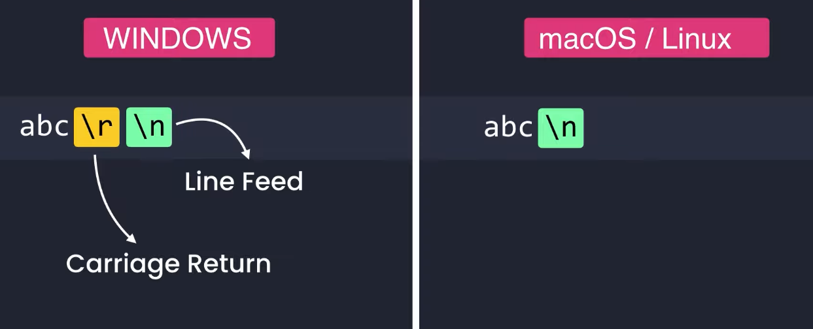
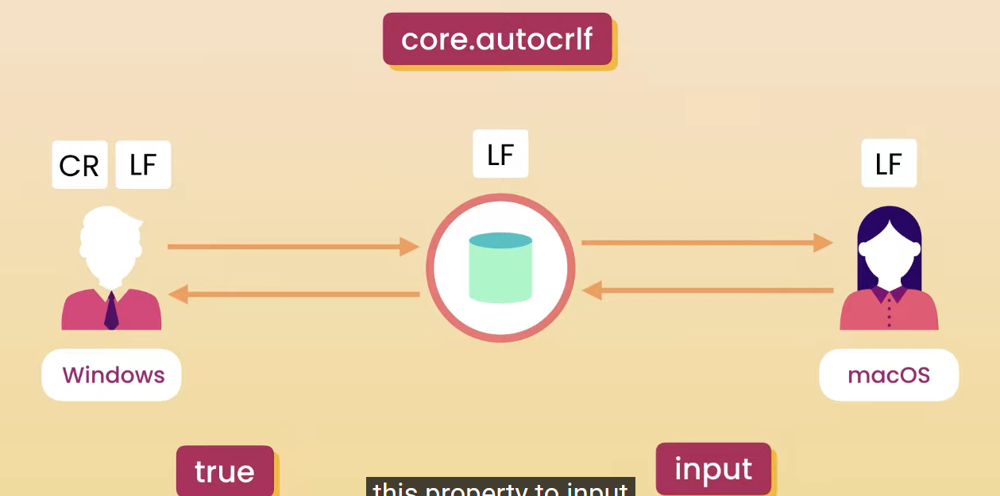

## SET up end of line

`this is oftenly forgotten by most of ppl`

## carriage return

`Line Feed 換行
不同系統MARK END OFＬＩＮＥＳ不一樣，如果兩個使用者用不同的系統下載和上傳ＣＯＤＥ到倉庫＊repository
系統會幫忙增加或是刪除carriage return（電腦鍵盤 回車鍵)，所以減少跨系統的問題`

### core.autocrlf
`Its the short form of carriage return`

### Win
> git config --global core.autocrlf true
### MAC/ LINUX
> git config --global core.autocrlf input