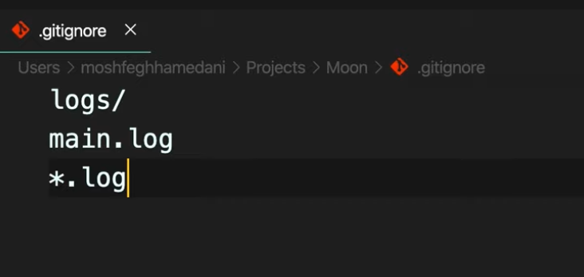

### すでにチェックインしたファイルを無視したい場合は、追跡を解除してから、それを無視するルールを追加します。 ターミナルから、ファイルの追跡を解除してください。

`$ git rm --cached -r ファイル名`

> delete bin folder in index(staging area)
--cached     刪除檔案在staging area ( indedx )
-r 	     allow recursive (*回歸的；遞迴的) removal 

#### 1.make a file name .gitignore
`touch .gitignore`

###https://github.com/github/gitignore
可以查詢哪些語言會有那些不需要上傳到github的語言

Remember to commit the change afterwards